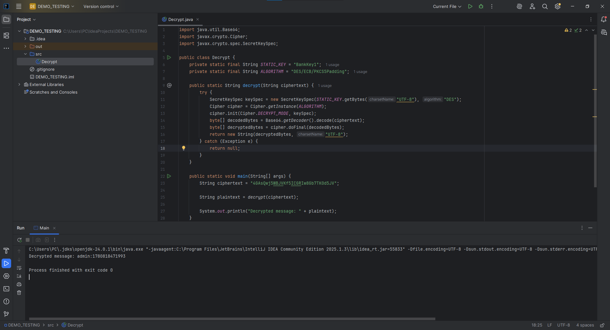
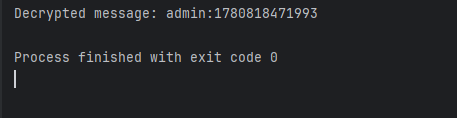
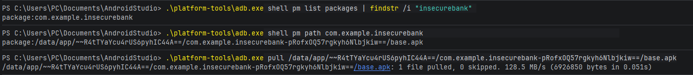
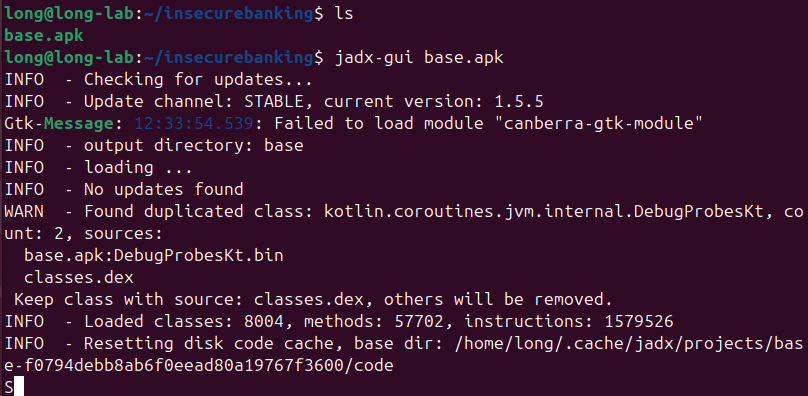
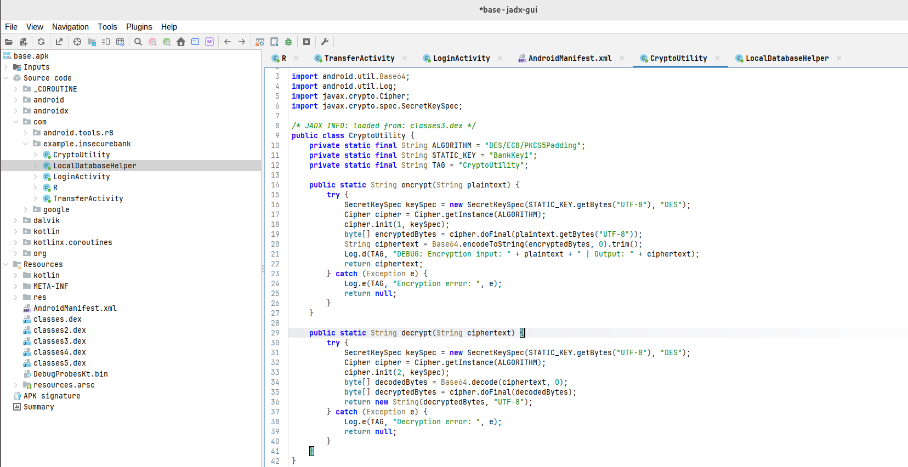
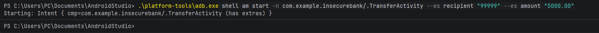
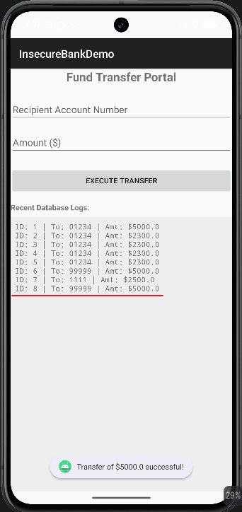

Following the guide in Vulnerbility_Test_Guide.md inside `insecurebankdemo` folder.

## OWASP MASVS Vulnerability Test

### 1. Local Storage:

SharedPreferences:

### 2. Backup enabled:

`python3 -c "import zlib; f=open('backup.ab','rb'); f.seek(24); open('backup.tar','wb').write(zlib.decompress(f.read()))"`

### 3. Crypto:

`Decrypted message: admin:1780818471993`

reverse engineer the apk file with jadx:

### 4. IPC/Exported:

